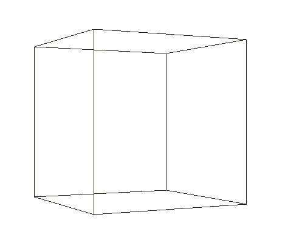
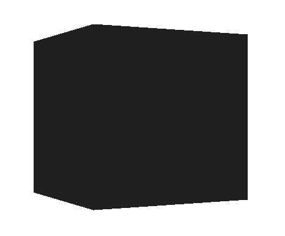
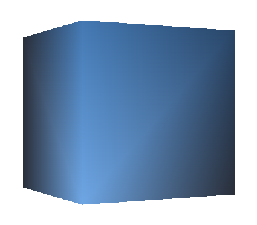

Balder has been throughout the development had the focus of extensibility, everything should be extensible. In Balder one has a set of object types, both 2D and 3D. For loading 3D models one has something called Mesh. This will automatically pick the right AssetLoader for the filetype based upon the file extension and parse the file and generate a 3D Mesh for Balder to render. Some of the other objects, which are considered primitives such as Box, Cylinder and Ring - are generated on the fly.

This tutorial will show how one can create an object that generates the Mesh data on the fly.

The process is quite simple. A Geometry holds something called a GeometryContext which is represented by the interface IGeometryContext, within the GeometryContext one has the ability to create something called a GeometryDetailLevel. The GeometryDetailLevel is the object being rendered depending on the detail level Balder wants to render it in. For the most part, Balder renders using the Full detail level. For Geometry there is a convenience property for the full detail level called FullDetailLevel in which one can use to generate its geometry.

To get started, the first thing we need to do is to create our object and inherit from Geometry.

```csharp using Balder.Objects.Geometries;

public class MyBox : Geometry { } ```

Now that we have our class and its inheriting Geometry, for Silverlight this means we can add it to our Silverlight page. Add a namespace for Balder Execution and View in your page Xaml file (xmlns:Execution="clr-namespace:Balder.Execution;assembly=Balder" and xmlns:View="clr-namespace:Balder.View;assembly=Balder"). Then you need to add an Xml namespace to the namespace of your MyBox class (something like this : xmlns:Custom="clr-namespace:Balder.Silverlight.SampleBrowser.Samples.Geometries.Custom").

Now you can add the Xml for Balder and MyBox inside the container you want it to be in the Xaml :

[](http://localhost:8080/wp-content/2010/08/Balder_Tutorial_Box_Xaml.png)  
It will not show anything yet, as we don't have any geometry data in the object yet.

The Geometry has a method on can override for preparing the object, its called Prepare().

```csharp public override void Prepare(Viewport viewport) { } ```

In the prepare method we can now start generating the 3D mesh data. We'll start by adding the vertices; 3D points that our geometry data (lines or faces) will be connected to. We create method called GenerateVertices() that we'll call from the Prepare() method. Each point in 3D is represented by something called a Vertex. A box consists of 8 vertices.

```csharp private void GenerateVertices() { var dimensionAsVector = new Vector(5f,5f,5f); var halfDimension = dimensionAsVector / 2f; var frontUpperLeft = new Vertex(-halfDimension.X, halfDimension.Y, -halfDimension.Z); var frontUpperRight = new Vertex(halfDimension.X, halfDimension.Y, -halfDimension.Z); var frontLowerLeft = new Vertex(-halfDimension.X, -halfDimension.Y, -halfDimension.Z); var frontLowerRight = new Vertex(halfDimension.X, -halfDimension.Y, -halfDimension.Z); var backUpperLeft = new Vertex(-halfDimension.X, halfDimension.Y, halfDimension.Z); var backUpperRight = new Vertex(halfDimension.X, halfDimension.Y, halfDimension.Z); var backLowerLeft = new Vertex(-halfDimension.X, -halfDimension.Y, halfDimension.Z); var backLowerRight = new Vertex(halfDimension.X, -halfDimension.Y, halfDimension.Z); FullDetailLevel.AllocateVertices(8); FullDetailLevel.SetVertex(0, frontUpperLeft); FullDetailLevel.SetVertex(1, frontUpperRight); FullDetailLevel.SetVertex(2, frontLowerLeft); FullDetailLevel.SetVertex(3, frontLowerRight); FullDetailLevel.SetVertex(4, backUpperLeft); FullDetailLevel.SetVertex(5, backUpperRight); FullDetailLevel.SetVertex(6, backLowerLeft); FullDetailLevel.SetVertex(7, backLowerRight); } ```

Notice the first line in the method, it just defines the size of the box in 3D space. The next thing we'll do is to add some lines to it. We'll add a method called GenerateLines() that we'll call from the Prepare() method.

```csharp private void GenerateLines() { FullDetailLevel.AllocateLines(12); FullDetailLevel.SetLine(0, new Line(0, 1)); FullDetailLevel.SetLine(1, new Line(2, 3)); FullDetailLevel.SetLine(2, new Line(0, 2)); FullDetailLevel.SetLine(3, new Line(1, 3)); FullDetailLevel.SetLine(4, new Line(4, 5)); FullDetailLevel.SetLine(5, new Line(6, 7)); FullDetailLevel.SetLine(6, new Line(4, 6)); FullDetailLevel.SetLine(7, new Line(5, 7)); FullDetailLevel.SetLine(8, new Line(0, 4)); FullDetailLevel.SetLine(9, new Line(1, 5)); FullDetailLevel.SetLine(10, new Line(2, 6)); FullDetailLevel.SetLine(11, new Line(3, 7)); } ```

The way this work is that every line is referring to the vertex index generated by the GenerateVertices(). Take the first line, it has the parameters 0 and 1, that means it is telling Balder to use vertex 0 and 1 to generate the line. When Balder has rotated all vertices according to the objects world and the view and then projected everything onto the 2D screen, it will use the result of the vertices to draw the line.

Running everything now should give you a result like the below.

[](http://localhost:8080/wp-content/2010/08/Balder_Tutorial_Box_Lines.png)If you want to use solids, making the object completely solid - we have to use Faces instead of Lines. A face is a triangle, and similar to a Line it references the vertices that represents the triangle. Only difference is that the order in which one connects the vertices are important. The reason for this is that Balder uses something known as backface culling, which means that triangles pointing away from the viewer is not drawn. Its important that one generates the faces with a counter clockwise connections between the vertices, as clockwise triangles will not show.

Let's create a GenerateFaces() method and swap it for the GenerateLines() method.

```csharp private void GenerateFaces() { FullDetailLevel.AllocateFaces(12); FullDetailLevel.SetFace(0, new Face(2,1,0)); FullDetailLevel.SetFace(1, new Face(1,2,3)); FullDetailLevel.SetFace(2, new Face(4,5,6)); FullDetailLevel.SetFace(3, new Face(7,6,5)); FullDetailLevel.SetFace(4, new Face(0,4,2)); FullDetailLevel.SetFace(5, new Face(6,2,4)); FullDetailLevel.SetFace(6, new Face(3,5,1)); FullDetailLevel.SetFace(7, new Face(5,3,7)); FullDetailLevel.SetFace(8, new Face(0,1,4)); FullDetailLevel.SetFace(9, new Face(5,4,1)); FullDetailLevel.SetFace(10, new Face(6,3,2)); FullDetailLevel.SetFace(11, new Face(3,6,7)); } ```

Running this should yield the following result:

[](http://localhost:8080/wp-content/2010/08/Balder_Tutorial_Box_Faces.png)As you'll notice the box is all black. There are two reasons for this; we haven't added a light to the scene yet and most importantly, in order for Balder to be able to calculate lights it needs to have something called a normal ve ctor on the vertices and faces. Luckily, there is something called a GeometryHelper that can be used to generate these. You simple add the following two lines of code in the prepare method after you've generated the vertices and faces :

```csharp GeometryHelper.CalculateFaceNormals(FullDetailLevel); GeometryHelper.CalculateVertexNormals(FullDetailLevel); ```

Then in the Xaml of the page, we'll need to import the Lighting namespace from Balder (xmlns:Lighting="clr-namespace:Balder.Lighting;assembly=Balder") and then we can add a light to the scene:

[](http://localhost:8080/wp-content/2010/08/Balder_Tutorial_Box_FinalXaml.png)  
The box has a property called Color, which it inherits - so setting it to Blue (Color="Blue") will give the box a specific color, instead of a random one, which is the default behavior.

You should be seeing something like this:

**[](http://localhost:8080/wp-content/2010/08/Balder_Tutoria._Box_Faces_Lit.png)Summary** Its fairly easy to generate meshes in Balder, but there are more possibilities that this tutorial does not cover, which will be covered by other tutorials. One thing to mention, if you need to regenerate the mesh data you can call the InvalidatePrepare() method, and your prepare method will be called again. Also worth mentioning, if you want to have a texture on the object, you need to generate TextureCoordinates, which is also done through the GeometryDetailLevel. Each face has something called DiffuseA,B,C which in a similar way as with vertices connects the different corners of the triangle to a specific texture coordinate. A texture coordinate is a relative coordinate ranging from 0 to 1 within a texture.
